

# Changelog for QGIS 3.36 {#changelog336}

Release date: 2024-02-23

The QGIS project continues to push the boundaries of open-source geospatial technology, as highlighted by the release of QGIS 3.36. The project continues to empower users to make even better spatial decisions with new features and improvements, and introduces a new core data provider for OGC SensorThings API data sources.

About our release name: Windsor and Maidenhead borough council was one of the first UK local authorities to move to QGIS (at version 1.8!) back in 2010/11. It was at Windsor and Maidenhead that Simon Miles and Matt Travis started the UK QGIS user group. It even hosted the first ever UK user group meeting. Windsor and Maidenhead also contributed financial to many an QGIS plugin and was also a bronze sponsor.

Among the exciting new features added to this release is a new "Movie Mode" for the temporal controller that facilitates the production of animated maps. This release also brings new functionalities for map tips (on Desktop and Server) and improvements to the growing collection of 3D functionality, giving users the power to take advantage of advanced data types, such as Meshes, Point Clouds, and 3D Tiles.

For a whirlwind tour of all the new functionalities introduced, you can view the [highlight reel video on YouTube](https://www.youtube.com/watch?v=WS9W1fo9Aso).

QGIS is a community effort, and we would like to extend a big thank you to the developers, documenters, testers, and the many folks out there who volunteer their time and effort (or fund people to do so) to make these releases possible. From the QGIS community, we hope you enjoy this release! If you wish to donate time, money, or otherwise contribute towards making QGIS more awesome, please wander along to [QGIS.ORG](https://qgis.org) and lend a hand!

QGIS is supported by donors and sustaining members. A current list of donors who have made financial contributions large or small to the project can be seen on our [list of donors](https://qgis.org/en/site/about/sustaining_members.html#list-of-donors). If you would like to become an official project sustaining member, please visit our [sustaining member page](https://qgis.org/en/site/about/sustaining_members.html) for more details. Sponsoring QGIS helps us to fund our regular developer meetings, maintain project infrastructure, and fund bug-fixing efforts. A complete list of current sponsors is provided below - our very thank you to all of our sponsors!

QGIS is free software and you are under no obligation to pay anything to use it - in fact, we want to encourage people far and wide to use it regardless of their financial or social status - we believe that empowering people with spatial decision-making tools will result in a better society for all of humanity.

## Breaking Changes 

### Feature: OTB Processing provider removed

**Due to a lack of ongoing maintenance, we've made the difficult decision to remove the Orfeo ToolBox (OTB) Processing provider from QGIS. Any users, plugins or scripts which require this functionality will need to be modified accordingly.**

Motivated members from the QGIS community are encouraged to create a 3rd party community maintained plugin to restore OTB support.

## Temporal 

### Feature: "Movie Mode" for the temporal controller

We've added a brand new "Movie" mode to the temporal controller. This mode has been designed to facilitate creating animated movies from maps. Unlike the other temporal controller modes, while movie mode is activated no time-based filtering of data is performed.

In movie mode, you can set the total number of frames for your movie and the animation will progress frame by frame for that number of frames, advancing the current map settings frame (and @frame\_number expression variable) at each step. You can then use animated symbols, or alter your symbology using the @frame\_number expression variable, to create dynamic, animated maps.

This feature was funded by [North Road](https://north-road.com)

This feature was developed by [Nyall Dawson (North Road)](https://north-road.com)

## User Interface 

### Feature: Custom layer properties in map layer properties

We've added display of custom layer properties for map layers within the layer properties information tab, making it easy for users to view any additional metadata and properties attached to their map layers.

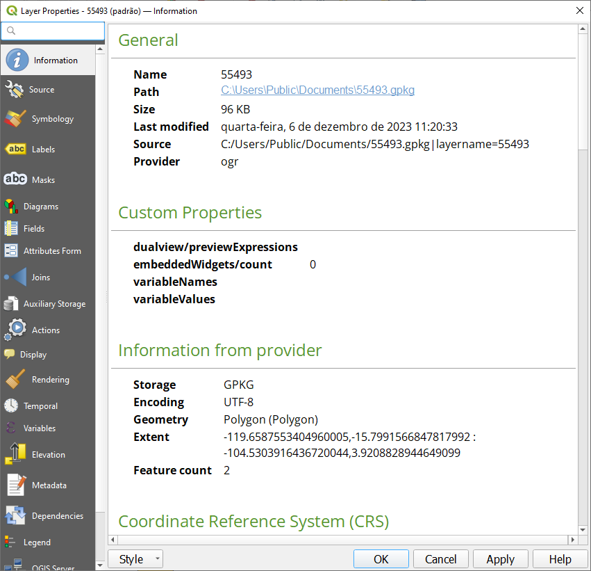

This feature was developed by [Jorge Alexandre Delesderrier da Silva](https://github.com/jadsilva)

### Feature: Easier project and image saving

In 3.36, we've made QGIS a little bit cleverer in the way it handles saving of projects and images. The project type (.qgz, .qgs) or image format (.png, .jpg, .tif, etc.) is now (by default) determined by any file extension you've typed in the save dialog. This allows for a faster user experience when changing from one format to another, as you don't need to manually set an explicit format in advance via the format combo box!

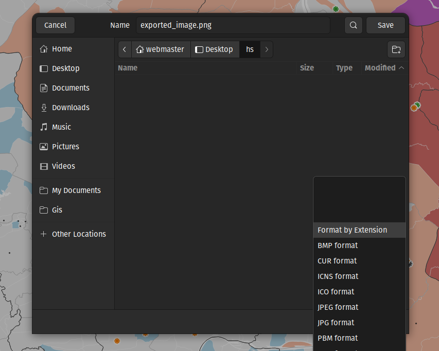

This feature was developed by [Mathieu Pellerin (OPENGIS.ch)](https://www.opengis.ch/)

## Symbology 

### Feature: Control image height for raster fill symbol layers

We've introduced a new setting for the "raster fill" symbol type, which allows you to control the width and height of the fill pattern independently. (Previously these settings were locked to each other). You're now able to create stretched raster fills in the horizontal or vertical directions, giving more flexibility for your custom symbol creation.

This feature was funded by [North Road, thanks to SLYR](https://north-road.com)

This feature was developed by [Nyall Dawson (North Road)](https://north-road.com)

### Feature: New "Filled line" symbol layer type

We've added a brand new line symbol type for "filled lines". Much like the older "Filled marker" symbol type offers for marker symbols, this option will render lines using **any** QGIS fill symbol. This means you can now render lines filled with gradients, line hatches, raster fills, and much more!

This feature was funded by [North Road, thanks to SLYR](https://north-road.com)

This feature was developed by [Nyall Dawson (North Road)](https://north-road.com)

## Mesh 

### Feature: Mesh labeling

In 3.36 we've added labeling support for mesh layers. Labels can be applied to mesh vertices, or mesh faces, and can take advantage of all the advanced formatting options and appearance settings that you get for vector labels. Labelling settings are available through layer properties dialog and the layer styling panel. Toggling mesh labels on and off can also be conveniently done through the layer panel's context menu.

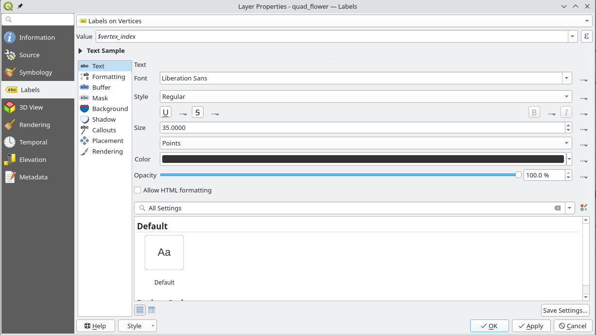

This feature was funded by GÖTEBORGS STAD

This feature was developed by [Stefanos Natsis (Lutra Consulting)](https://www.lutraconsulting.co.uk/)

## 3D Features 

### Feature: Data defined color control for simple 3d line rendering

You can now set a data-defined, dynamic color for 3D lines rendered using the "Render as simple 3D lines" option. This is extremely useful for visualising line features in 3D, eg displaying underground pipelines in different colors based on their classifications.

This feature was funded by [North Road](https://north-road.com)

This feature was developed by [Nyall Dawson (North Road)](https://north-road.com)

### Feature: Improved "Phong" material and lighting

The Phong shader is used as the default material for showing vector features in QGIS 3D views. For 3.36, this shader has been improved to better handle ambient and shininess parameters. Additionally, we've taken care to ensure that the exact same shading will apply regardless of the underlying geometry type (points, lines or polygons), and regardless of whether data defined symbol colors are in use. This gives users a much more predictable and easy-to-configure material for their 3D views.

For easier configuration of nicer-looking materials, we also added new controls for modifying the strength of the ambient, diffuse, and specular lighting contributions.

This feature was funded by [North Road](https://north-road.com)

This feature was developed by [Nyall Dawson (North Road)](https://north-road.com)

### Feature: "Physically based" metal rough material

For even more beautiful 3D maps, we've added a new material choice for a "physically based rendering" (PBR) material. This material lets you define the base color of the surface, and how "metal" and "rough" it should appear. This material is simple to configure and get great results from, and is expected to become the default material in a future QGIS release.

This feature was funded by [North Road](https://north-road.com)

This feature was developed by [Nyall Dawson (North Road)](https://north-road.com)

### Feature: Define 3D scene extents on 2D maps

We added a shortcut action to the 3D map toolbar that allows users to quickly draw an extent limit for the scene on a 2D map.

This feature was funded by Natural Resources Canada

This feature was developed by [Stefanos Natsis (Lutra Consulting)](https://www.lutraconsulting.co.uk/)

## Point Clouds 

### Feature: Size overrides for point cloud classification

In QGIS 3.36 you can now override the default point size for discrete categories in both 2D and 3D views.

A new "Size" column was added to the categories widget, which will appear blank when a category inherits the default point size but allows you to manually specify the size with numeric input. Setting the Size value to 0 for a category will reset it to use the layer's default point size.

You can also use the right-click context menu to set the point size for multiple selected categories at once.

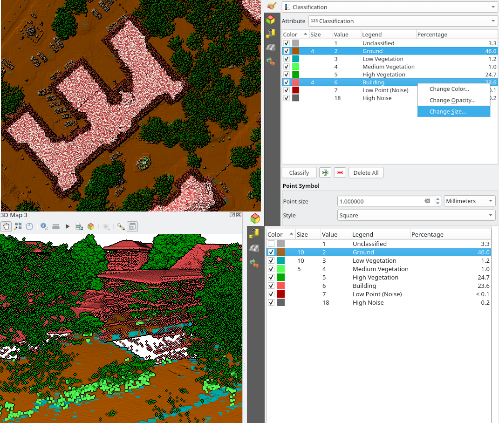

This feature was funded by Natural Resources Canada

This feature was developed by [Stefanos Natsis (Lutra Consulting)](https://www.lutraconsulting.co.uk/)

### Feature: Render point clouds as a surface in 2D maps

We've added a new option for 2D styling of Point Clouds that for "Render as a Surface (Triangulate)".

When enabled, QGIS will perform an on-the-fly Delaunay triangulation of the points in the current map view and render the layer as filled triangles instead of individual points. The color of each point is maintained and interpolated within each triangle.

Global map shading is also supported with the new option so that, when enabled, the elevation of points is retained and a rasterized instance of the triangles with interpolated elevations can be provided to the elevation map.

When "Render as a surface" is enabled, drawing order is ignored and all input points participate in the triangulation.

We also added an option to filter large triangles (based on the maximum length of an edge of a triangle), which allows for visualizing data gaps, but the 2D rendering only provides filtering based on the horizontal length of triangles.

Be sure to check out the feature [Pull Request](https://github.com/qgis/QGIS/pull/55332) on GitHub for a showcase of the new functionality in different modes and contexts.

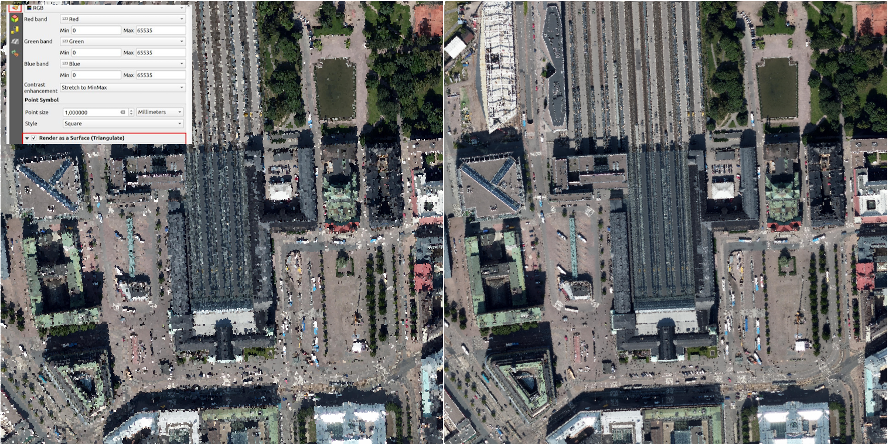

This feature was funded by National Resources Canada

This feature was developed by [Martin Dobias (Lutra Consulting)](https://www.lutraconsulting.co.uk/)

### Feature: Faster point cloud rendering by caching decoded data blocks

Want even faster point cloud rendering? Well, QGIS now supports rendering point clouds faster by using a cache for storing nodes which have already been decoded.

This optimisation avoids decompressing the same nodes multiple times when panning or zooming, especially when using compressed data sources such as LAZ formatted files.

(A fixed size cache of 200MB is used and shared across all point cloud layers and canvases (2D, 3D, and Profile Plots).)

This feature was funded by Natural Resources Canada

This feature was developed by [Stefanos Natsis (Lutra Consulting)](https://www.lutraconsulting.co.uk/)

### Feature: Metadata preservation during COPC conversion

The Untwine tool (which is responsible for conversions of point clouds to the COPC format within QGIS) has been updated to version 1.3. This includes various fixes and small enhancements. Among the enhancements, the conversion to COPC now preserves the following metadata from LAS/LAZ files:

-   Global encoding
-   Creation time (year+day)
-   XYZ offset

This feature was funded by Natural Resources Canada

This feature was developed by [Stefanos Natsis (Lutra Consulting)](https://www.lutraconsulting.co.uk/)

### Feature: Better handling of classification flags

LAS/LAZ files may include four flags for each point (synthetic, key-point, withheld, overlap). In older QGIS releases, they have all been exposed in `ClassificationFlags` as a combined single value. This has been impractical when a user needs to use one of those flags for filtering or visualization.

For version 3.36, we reworked things so that these flags are available as separate attributes both for visualization (eg using the Classification renderer) and for filtering in expressions. Accordingly, we've removed the older `ClassificationFlags` attribute.

This feature was funded by National Resources Canada

This feature was developed by [Stefanos Natsis (Lutra Consulting)](https://www.lutraconsulting.co.uk/)

## Expressions 

### Feature: Alias of minimum/maximum for min/max in aggregates

We've added some new aliases for arguments to the aggregate expression functions, so that "minimum" and "maximum" can be used instead of "min" and"max" for these functions.

This feature was developed by [Harrissou Sant-anna](https://github.com/DelazJ)

### Feature: @counter variable for array\_foreach

We've added a new "@counter" variable to the `array_foreach` function in expressions. Among other things, this lets you combine values across multiple array fields.

Example:

`array_foreach( "field_1", @element || ' ' || "field_2"[@counter] )`

This feature was developed by [Björn Hinkeldey](https://github.com/pathmapper)

### Feature: Improved expression insertion

To make QGIS 3.36 even more user-friendly, we've tweaked the "Insert/Edit Expression" behavior. Now,

-   If some text is selected and your selection is within an expression (i.e. between "\[%" and "%\]"), the expression editor will select the whole expression
-   If no text is selected, and your cursor is inside an expression, the whole expression is selected
-   Otherwise, the expression editor will open with your existing selection.

Additionally, we added a new "Insert/Edit Expression" button to the vector layer properties MapTip tab.

This new expression editing behavior also applies to Print Layout labels, Titles, and Copyright decorations, as well as Annotation items.

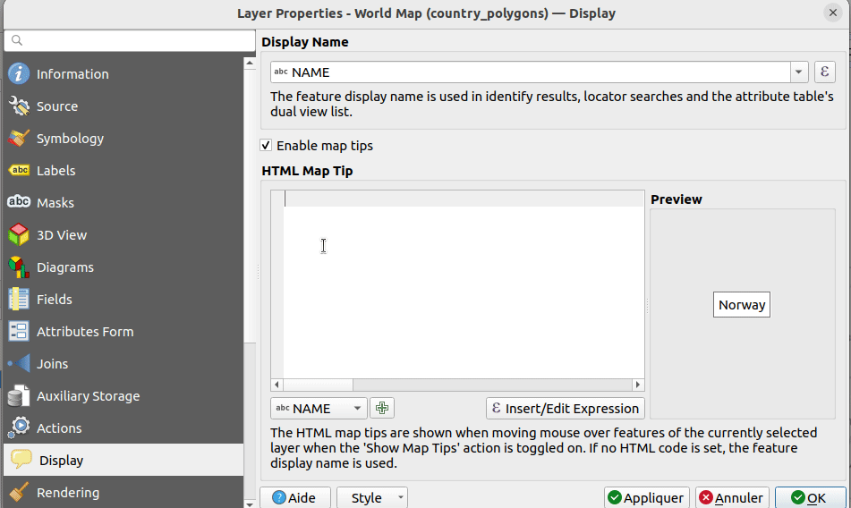

This feature was developed by [Yoann Quenach de Quivillic](https://github.com/YoannQDQ)

## Data Management 

### Feature: Toggle Selection in the Organize columns window

We added a Toggle Selection button to the Organize Columns dialog to improve your ability to manage datasets with a large number of fields.

The new Toggle Selection button (as well as the Deselect or Select All buttons) will only appear when there are more than 5 fields in a layer.

This feature was developed by [Valentin Buira](https://github.com/Poulpator)

## Processing 

### Feature: --skip-loading-plugins flag for qgis\_process

The `qgis_process` command line interface tool benefits from a new `--skip-loading-plugins` argument. If specified, this can result in faster execution times for commands such as `qgis_process plugins`, which can now list the installed plugins \*\*without\*\* loading them.

This feature was funded by [Research Institute for Nature and Forest (INBO)](http://www.inbo.be/en)

This feature was developed by [Nyall Dawson (North Road)](https://north-road.com)

### Feature: Click to open output paths in processing logs

A super-helpful new shortcut we added to 3.36 is that any output paths (such as file, folder, or HTML outputs) in the Processing log are now clickable, allowing you to directly open the containing folder and preselect the generated file!

This feature was funded by [North Road](https://north-road.com)

This feature was developed by [Nyall Dawson (North Road)](https://north-road.com)

### Feature: Vector coverage algorithms

QGIS 3.36 introduces a number of new tools for working with vector coverage layers. "Vector coverages" are polygon layers where the features are expected to neighbour each other, without overlaps or gaps, such as administrative boundary layers. These new Processing algorithms expose tools for working with coverages, including:

-   **Validate coverage**: This algorithm analyzes a coverage to find places where the assumption of exactly matching edges is not met.
-   **Simplify coverage**: This algorithm applies a Visvalingam–Whyatt simplification to the edges in a coverage, while retaining a valid coverage (ie no edges will cross or touch after the simplification)
-   **Dissolve coverage**: This algorithm provides a heavily optimised approach for unioning polygons from a coverage layer, when compared against the standard Dissolve tools.

These new tools rely on functionality from the GEOS geometry handling library. Our thanks go to the GEOS maintainers for making this work possible!

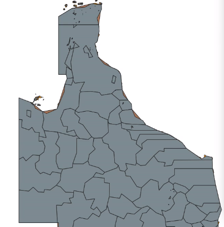

This feature was funded by [North Road](https://north-road.com)

This feature was developed by [Nyall Dawson (North Road)](https://north-road.com)

### Feature: Improved Export Layers to DXF algorithm

We've introduced a number of new parameters to the "Export Layers to DXF" algorithm , to match the functionality of its non-Processing counterpart:

-   An extent parameter to filter features to be exported
-   A map theme parameter to override the layers' symbology when exporting

We've also fixed several shortcomings in the algorithm, including skipping layers within which no features were exported.

This feature was funded by [QGIS Swiss User Group (QGIS-CH)](https://www.qgis.ch/)

This feature was developed by [Mathieu Pellerin (OPENGIS.ch)](https://www.opengis.ch/)

### Feature: Faster GRASS Provider startup

We've reworked the backend of the Processing GRASS Provider, which helps reduce the startup times for this plugin (especially on Windows installations!). This is especially beneficial for users of the `qgis_process` tool, who will experience noticeably faster execution times for this tool.

This feature was funded by [Research Institute for Nature and Forest (INBO)](http://www.inbo.be/en)

This feature was developed by [Nyall Dawson (North Road)](https://north-road.com)

### Feature: Faster qgis\_process startup

For 3.36, we've substantially improved the startup speed of the `qgis_process` command. This was done by applying a variety of optimisations inside QGIS, such as lazy loading of the authentication and style library frameworks so that these frameworks are only initialised when required, and by reworking the logic for migrating user settings between different QGIS versions to avoid unnecessary work.

Together, these improvements have reduced `qgis_process` startup times from multiple seconds to less than one second!

This feature was funded by [Research Institute for Nature and Forest (INBO)](http://www.inbo.be/en)

This feature was developed by [Nyall Dawson (North Road)](https://north-road.com)

## Application and Project Options 

### Feature: "localhost" option for OAuth2 Redirects

Some OAuth2 providers, like Microsoft Sharepoint, require specific redirect hosts for security reasons. They may not accept the standard "http://127.0.0.1" redirect, but instead allow only "https://127.0.0.1" or "http://localhost".

To ensure compatibility with these providers without the complexity of setting up HTTPS, we added a new option to use "localhost" as the redirect host for OAuth2 authentication.

This feature was funded by [North Road](https://north-road.com)

This feature was developed by [Nyall Dawson (North Road)](https://north-road.com)

### Feature: Serial port sensor baudrate selection

For 3.36 you can now customize the connection speed (baud rate) to use for serial port sensors. Previously, this parameter was hardcoded at 9600 baud, limiting compatibility with various sensor types, such as NMEA sensors requiring 4800 baud. You can now connect to a wider array of sensors by adjusting the baud rate to meet specific requirements.

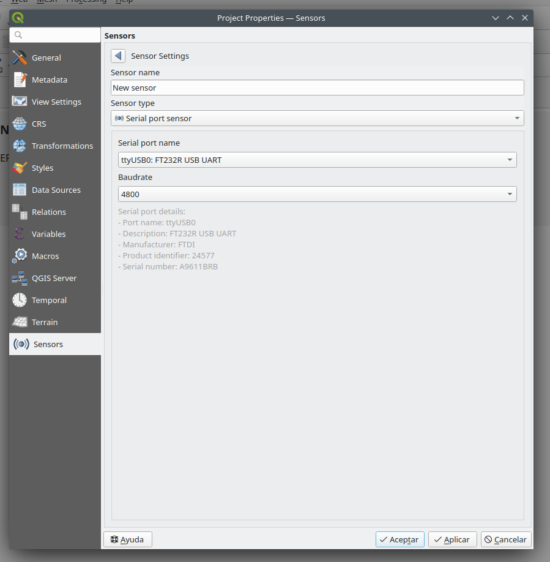

This feature was developed by [Jorge Tornero](https://github.com/jtornero)

## Browser 

### Feature: Open layers with Datasource Manager from browser

We've introduced a new option in the QGIS browser context menu for "Open with Datasource Manager...". This option is available for layers which use the OGR provider (including GPKG sources), GDAL provider (raster layers), and Spatialite layers. When activated, a dialog will open on the data source tab of the layer properties, with relevant field values prepopulated to open the layer directly in QGIS, which allows you to set more comprehensive file opening options directly from the browser.

This functionality brings with it the `ConfigureFromUri` method which has been developed for the Python and C++ APIs. This method will enable source selection widgets to open and configure the data source manager directly from a data source URI, allowing the development of more sophisticated data loading options such as within plugins and when using the Change Data Source utility.

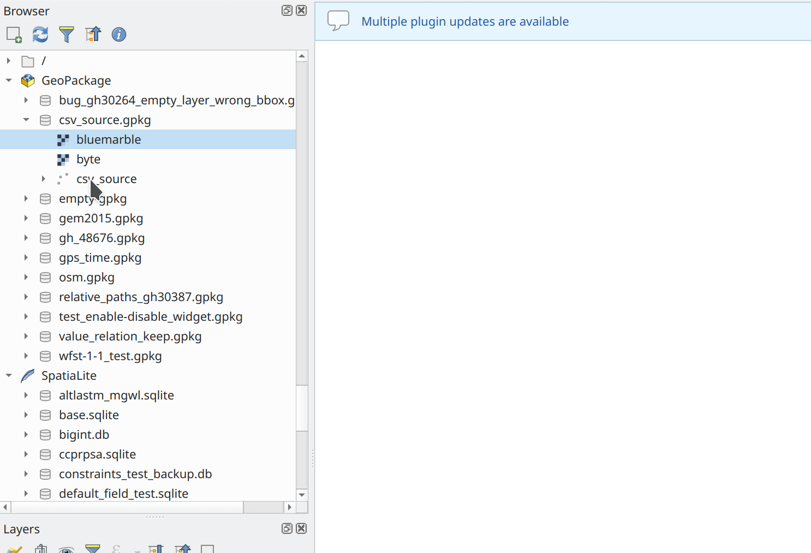

This feature was funded by NOAA

This feature was developed by [Alessandro Pasotti](https://github.com/elpaso)

## Data Providers 

### Feature: SensorThings Data Provider

For version 3.36 we've introduced a brand new core data provider for OGC SensorThings API data sources.

The [SensorThings API](https://docs.ogc.org/is/15-078r6/15-078r6.html) is an OGC specification for Internet of Things sensors which complements existing communication protocols within the IoT ecosystem.

This functionality was developed in line with [QEP 257](https://github.com/qgis/QGIS-Enhancement-Proposals/issues/257) and introduces new panels within the QGIS Browser, Data Source Manager, and Layer Properties Source tab for users to configure connections to SensorThings data sources.

We've taken care to ensure that SensorThings data sources are loaded in the most optimised way possible, providing an streamlined, user-friendly way to load SensorThings data into your QGIS projects. This is just the beginning though, and we've more functionality and improvements planned for access to SensorThings sources in QGIS 3.38!

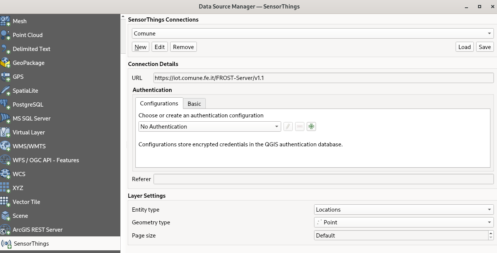

This feature was developed by [Nyall Dawson (North Road)](https://north-road.com)

### Feature: Support for WFS documents with complex feature schemas

We enhanced the WFS Provider to add support for complex feature schemas. The implementation exposes properties of complex WFS types as JSON content, converted from their original XML representations.

For more details, see the [QGIS Enhancement Proposal](https://github.com/qgis/QGIS-Enhancement-Proposals/issues/277).

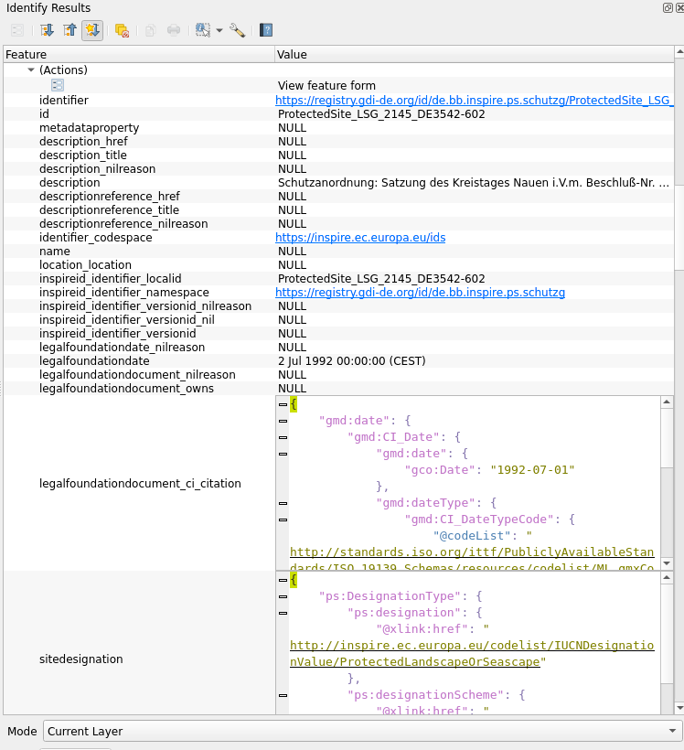

This feature was funded by [QGIS user group Germany](https://qgis.de/)

This feature was developed by [Even Rouault](https://github.com/rouault)

## QGIS Server 

### Feature: WMS GetMap in PDF Format

QGIS Server will now support responses in PDF format for GetMap requests.

This feature was developed by [mhugent](https://github.com/mhugent)

### Feature: QGIS Server Properties Tab for Vector Tile Layers

The Layer Properties Dialog for Vector Tile layers will now include a section for editing the QGIS Server layer settings, providing the ability to configure layer-specific settings such as shortname, abstract, and other metadata.

This feature was developed by [Sandro Mani](https://github.com/manisandro)

### Feature: GetLegendGraphics JSON rule

We've added a new `SHOWRULEDETAILS` parameter for WMS services, which will append a **rule** item in the legend entry. The rule describes the filter expression used on the respective layer when performing a `GetLegendGraphic` request using the JSON format option.

For example, the request:

`text GET /?SERVICE=WMS&VERSION=1.30&REQUEST=GetLegendGraphic&LAYERS=layer1&FORMAT=application/json&SHOWRULEDETAILS=1`

Will return the JSON response which includes a `rule` field when appropriate:

`json `

This feature was funded by Kristianstadt

This feature was developed by [Alessandro Pasotti](https://github.com/elpaso)

### Feature: Add maptip for raster layer GetFeatureInfo

Maptip support was added for raster layer GetFeatureInfo responses, when requesting with parameter `WITH_MAPTIP=TRUE`. This matches the existing behavior which was in place for vector layers.

In this context, the variable `layer_cursor_point` holds the GetFeatureInfo position, so that maptips which are working in QGIS desktop are working also with QGIS Server GetFeatureInfo.

This feature was developed by [Björn Hinkeldey](https://github.com/pathmapper)

### Feature: WMS parameter to request only maptip for HTML feature info responses

We added a new value `HTML_FI_ONLY_MAPTIP` for the existing WMS vendor parameter `WITH_MAPTIP`.

If set, the feature info HTML response includes only the maptip, which gives full control over the HTML response using e.g. the built-in maptip editor which has a nice preview.

This feature was developed by [Björn Hinkeldey](https://github.com/pathmapper)

### Feature: Option to skip "name" attribute for groups in WMS GetCapabilities

We've added a new project level setting to **Skip name attribute for groups**. This is disabled by default, but enabling it allows you to exclude group names from a GetCapabilities response on a WMS request. This prevents name duplication in instances where a layer and group share the same name, whilst preserving the group element and bringing the QGIS Server capabilities more in line with the OGC WMS Specification.

For example:

`text <Layer queryable="1">   <Name>layer_name</Name> <--- this will be skipped when option is enabled   <Title>Human readable name</Title>`

This feature was developed by [Tomas Straupis](https://github.com/tomass)

## Plugins 

### Feature: Use active layer when importing vector data with DB Manager

When importing vector data in the DB Manager core plugin, the "Input" combo box, which is populated with all the vector data in the layer tree, is now automatically set to the active layer whenever possible. This small change makes it much more user-friendly, especially when working with large and complex projects!

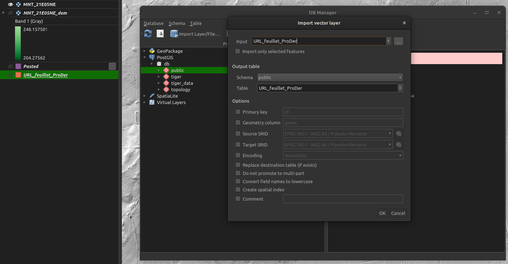

This feature was developed by [Patrice Pineault](https://github.com/TurboGraphxBeige)

## Programmability 

### Feature: Expose 3D views to PyQGIS

You now have the ability to create, list, and close 3D views from Python, matching the functionality of their 2D counterparts.

We refactored a number of application classes to introduce support the following `iface` methods:

-   `createNewMapCanvas3D`: Creates a named 3D view instance
-   `closeMapCanvas3D`: Closes a 3D view by name
-   `mapCanvases3D`: List existing 3D views in the project context

Example:

\`\`\`

> > > iface.createNewMapCanvas3D('my new 3d view') iface.mapCanvases3D() \[\] iface.closeMapCanvas3D('my new 3d view') iface.mapCanvases3D() \[\] \`\`\`

This feature was funded by Natural Resources Canada

This feature was developed by [Stefanos Natsis (Lutra Consulting)](https://www.lutraconsulting.co.uk/)

### Feature: Optimised methods to convert GeoJSON geometries to QgsGeometry

We've added some highly optimised methods which allow direct construction of geometries (QgsGeometry) from raw JSON objects, instead of requiring translation through another library's geometry structures. These methods are exposed through the new API call `QgsJsonUtils.geometryFromGeoJson`.

This feature was developed by [Nyall Dawson (North Road)](https://north-road.com)

### Feature: Qt WebEngine classes can now be used by plugins

In older QGIS versions, an incompatibility between the modern Qt "WebEngine" classes and QGIS' 3D framework prevented QGIS plugins from using any WebEngine widgets. This was a significant shortcoming, as the older Qt "WebKit" widgets were very limited, slow, and did not support many modern JavaScript essentials.

In 3.36, we've reworked how QGIS 3D is initialised to remove this incompatibility. Scripts and plugins can now safely use Qt's WebEngine classes without issue!

This feature was funded by <https://qgis.org>

This feature was developed by QGIS.org

### Feature: Vertical and compound Coordinate Reference System support in CRS widgets

As part of the ongoing QGIS grant project for vertical CRS handling (see [QEP 267](https://github.com/qgis/QGIS-Enhancement-Proposals/issues/267)), all of QGIS' coordinate reference system can now be set to show only vertical or compound CRS. This allows plugins and scripts to present users with choices of vertical CRS, ready for use in QgsCoordinateTransform objects for vertical CRS transformations.

See QgsCoordinateReferenceSystemProxyModel.Filter for the available CRS filtering options for use in these widgets.

This feature was funded by [QGIS.org](https://qgis.org)

This feature was developed by [Nyall Dawson (North Road)](https://north-road.com)

### Feature: Python support in Qt6 builds

While version 5.15 remains the recommended Qt version for compiling QGIS, we've been hard at work adding full support for Qt 6 builds of QGIS. This is necessary in order to support modern desktop requirements, such as full compatibility with Wayland based Linux environments and for optimised Apple silicon builds.

QGIS 3.36 brings support for running Python under Qt 6 builds, and enables use of the PyQGIS library within Qt 6. This is a significant milestone in our ongoing journey towards full support for Qt 6!

This feature was funded by [QGIS.org](https://qgis.org)

### Feature: Add meshMenu to QGIS Interface

`meshMenu` has been added to the `iface` object, giving plugins and scripts an easy way to extend the Mesh menu.

This feature was developed by [Loïc Bartoletti](https://oslandia.com/)

### Feature: Server: onProjectReady method for filter plugins

The new `onProjectReady` method is called after the `QgsProject` instance is ready for a server request and before entering the main logic for core services.

The `onRequestReady` method is called after the `QgsRequestHandler` is ready and populated with parameters, but before the `QgsProject` instance is ready.

You can use `onProjectReady` to perform operations at the project level, like adding variables, checking vector layer categories, etc.

This feature was funded by 3Liz

This feature was developed by [rldhont](https://github.com/rldhont)

### Feature: Add fuzzy comparisons methods

We've added new methods for `fuzzyEquals` and `fuzzyDistanceEquals` to the QGIS geometry classes. These methods compare geometric objects with a tolerance for small variations, enhancing the precision of equality and distance calculations. They will be particularly useful in scenarios where exact matches may not be feasible or necessary.

\`\`\`python epsilon = 0.001 geom1 = QgsLineString(QgsPoint(0.0, 0.0), QgsPoint(0.001, 0.001)) geom2 = QgsLineString(QgsPoint(0.0, 0.0), QgsPoint(0.002, 0.002))

self.assertNotEqual(geom1, geom2) \# epsilon = 1e-8 here

self.assertTrue(geom1.fuzzyEqual(geom2, epsilon)) self.assertFalse(geom1.fuzzyDistanceEqual(geom2, epsilon)) \`\`\`

This feature was funded by [QGIS.ORG (through GRANT)](https://qgis.org/)

This feature was developed by [Loïc Bartoletti](https://oslandia.com/)

### Feature: Measured line methods

In QGIS 3.36 we've introduced a `measuredLine` method within `Qgs(Multi)LineString`. This method builds upon the code from PostGIS behind ST\_AddMeasure.

This feature was developed by [Loïc Bartoletti](https://oslandia.com/)

## Notable Fixes 

### Feature: Bug fixes by Alessandro Pasotti (itOpen / qcooperative)

Bug Title | URL issues.qgis.org (if reported) | URL Commit (Github) | 3.34 backport commit (GitHub) -- | -- | -- | -- QGIS Server WMS wrong tile boundary | [\#55747](https://github.com/qgis/QGIS/issues/55747) | Works for me (awaiting feedback) | SLD: Hang when saving sld with linepattern orientation greater then 90 | [\#55920](https://github.com/qgis/QGIS/issues/55920) | [PR \#55928](https://github.com/qgis/QGIS/pull/55928) | [PR \#55933](https://github.com/qgis/QGIS/pull/55933) SLD saving ignores setting for exporting polygon fills as png tiles | [\#55921](https://github.com/qgis/QGIS/issues/55921) | [PR \#55928](https://github.com/qgis/QGIS/pull/55928) | [PR \#55933](https://github.com/qgis/QGIS/pull/55933) Drill down widget not working when parent field has the completer option activated | [\#55922](https://github.com/qgis/QGIS/issues/55922) | [PR \#55940](https://github.com/qgis/QGIS/pull/55940) | [PR \#55951](https://github.com/qgis/QGIS/pull/55951) Open Feld Calculator Crash | [\#55898](https://github.com/qgis/QGIS/issues/55898) | feedback | Secured WMS regression in 3.28 / 3.34?; service does not load but loads in earlier QGIS versions / other wms clients. | [\#55984](https://github.com/qgis/QGIS/issues/55984) | Works for me | \[QGIS Server\]\[WMS\] getLegend - Raster layers values not showed in legend | [\#55651](https://github.com/qgis/QGIS/issues/55651) | [PR \#56026](https://github.com/qgis/QGIS/pull/56026) | [PR \#56257](https://github.com/qgis/QGIS/pull/56257) Attribute table frame, with "allow url to be read as HTML format" has not expected result like hyperlink when output PDF file is maked from “GetPrint” request from QGIS Server | [\#52370](https://github.com/qgis/QGIS/issues/52370) | Not a bug | WMS provider Cannot calculate extent error adding a WMTS layer from QGIS server | [\#47349](https://github.com/qgis/QGIS/issues/47349) | Works for me | Raster Calculator Raster Menu - on the fly layer name gives issues | [\#55890](https://github.com/qgis/QGIS/issues/55890) | [PR \#56067](https://github.com/qgis/QGIS/pull/56067) | TODO Expanding PostGIS table/schema in browser panel triggers slow inspection of all tables in schema | [\#56069](https://github.com/qgis/QGIS/issues/56069) | [PR \#56090](https://github.com/qgis/QGIS/pull/56090) | [PR \#56385](https://github.com/qgis/QGIS/pull/56385) Secured WMS regression in 3.28 / 3.34?; service does not load but loads in earlier QGIS versions | [\#55984](https://github.com/qgis/QGIS/issues/55984) | Turned into a feature request after debugging | QGis crashes when digitizing with snapping | [\#53956](https://github.com/qgis/QGIS/issues/53956) | [PR \#56131](https://github.com/qgis/QGIS/pull/56131) | [PR \#56204](https://github.com/qgis/QGIS/pull/56204) Ellipse symbol size units are lost when closing the dialog | [\#56236](https://github.com/qgis/QGIS/issues/56236) | [PR \#56237](https://github.com/qgis/QGIS/pull/56237) | [PR \#56248](https://github.com/qgis/QGIS/pull/56248) QgsFields are viewed as the same despite having different QgsEditorWidgetSetup's | [\#55873](https://github.com/qgis/QGIS/issues/55873) | [PR \#56264](https://github.com/qgis/QGIS/pull/56264) | [PR \#56272](https://github.com/qgis/QGIS/pull/56272) Expression with newline and quotes in mulExpression with newline and quotes in multiline comment leads to syntax errortiline comment leads to syntax error | [\#55518](https://github.com/qgis/QGIS/issues/55518) | [PR \#56315](https://github.com/qgis/QGIS/pull/56315) | [PR \#56339](https://github.com/qgis/QGIS/pull/56339) Linebreak and text vanish in HTML label | [\#55532](https://github.com/qgis/QGIS/issues/55532) | [PR \#56334](https://github.com/qgis/QGIS/pull/56334) | no (risky) Postgres raster: sparse values of rasters are not displayed correctly | [\#55784](https://github.com/qgis/QGIS/issues/55784) | [PR \#56363](https://github.com/qgis/QGIS/pull/56363) | Failed with unrelated error Running VACUUM via browser shows an error messages without identififiers | [\#56377](https://github.com/qgis/QGIS/issues/56377) | [PR \#56380](https://github.com/qgis/QGIS/pull/56380) | TODO SHP: Fix unreported issue with spatialindex | unreported | [PR \#56366](https://github.com/qgis/QGIS/pull/56366) | [PR \#56399](https://github.com/qgis/QGIS/pull/56399) WFS sublayer is missing when FeatureType is added from QGIS browser | [\#56403](https://github.com/qgis/QGIS/issues/56403) | [PR \#56404](https://github.com/qgis/QGIS/pull/56404) | TODO

This feature was funded by [QGIS.ORG (through donations and sustaining memberships)](https://qgis.org/)

This feature was developed by [Alessandro Pasotti (itOpen / qcooperative)](https://www.qcooperative.net/)

### Feature: Bug fixes by Even Rouault (Spatialys)

Bug Title | URL issues.qgis.org (if reported) | URL Commit (Github) | 3.34 backport commit (GitHub) -- | -- | -- | -- Sort WFS layers ASC by default (and not DESC) | [\#55693](https://github.com/qgis/QGIS/issues/55693) | [PR \#55947](https://github.com/qgis/QGIS/pull/55947) | [PR \#55953](https://github.com/qgis/QGIS/pull/55953) Value Relation widget with Filter Expression makes QGIS crash in editing mode | [\#55854](https://github.com/qgis/QGIS/issues/55854) | [PR \#55948](https://github.com/qgis/QGIS/pull/55948) | [PR \#55952](https://github.com/qgis/QGIS/pull/55952) Hang/Crash when attempting to drag&drop multiple layers into gpkg | [\#29510](https://github.com/qgis/QGIS/issues/29510) | [PR \#55950](https://github.com/qgis/QGIS/pull/55950) | TODO Crash on KML load | [\#55963](https://github.com/qgis/QGIS/issues/55963) | [GDAL PR 9131](https://github.com/OSGeo/gdal/pull/9131) | [GDAL PR 9204](https://github.com/OSGeo/gdal/pull/9204) Value Relation widget with Filter Expression makes QGIS crash in editing mode | [\#55854](https://github.com/qgis/QGIS/issues/55854) | [PR \#55980](https://github.com/qgis/QGIS/pull/55980) | [PR \#55986](https://github.com/qgis/QGIS/pull/55986) QGIS crashes when move tool is active and non-vector layer is selected | [\#55492](https://github.com/qgis/QGIS/issues/55492) | [PR \#55981](https://github.com/qgis/QGIS/pull/55981) | [PR \#55985](https://github.com/qgis/QGIS/pull/55985) Trailing slashes are silently removed from filter strings | [\#55975](https://github.com/qgis/QGIS/issues/55975) | [PR \#55988](https://github.com/qgis/QGIS/pull/55988) | [PR \#55993](https://github.com/qgis/QGIS/pull/55993) Vector layer points are not being imported/shown from MySQL datasource | [\#55463](https://github.com/qgis/QGIS/issues/55463) | [GDAL PR 9152](https://github.com/OSGeo/gdal/pull/9152) | [GDAL PR 9180](https://github.com/OSGeo/gdal/pull/9180) OAPIF: Adding layer with lot of vertices freezes QGIS | [\#56059](https://github.com/qgis/QGIS/issues/56059) | [PR \#56066](https://github.com/qgis/QGIS/pull/56066) | [PR \#56095](https://github.com/qgis/QGIS/pull/56095) \[PostgreSQL provider\] Add missing namespace escaping in SQL requests | unreported | [PR \#56173](https://github.com/qgis/QGIS/pull/56173) | [PR \#56186](https://github.com/qgis/QGIS/pull/56186) Export Save features to gpkg does not keep Field Domains, but using Convert Format does | [\#56184](https://github.com/qgis/QGIS/issues/56184) | [PR \#56209](https://github.com/qgis/QGIS/pull/56209) | Not appropriate QGIS crashes after making a connection to a GeoPackage | [\#56203](https://github.com/qgis/QGIS/issues/56203) | [PR \#56210](https://github.com/qgis/QGIS/pull/56210) | [PR \#56214](https://github.com/qgis/QGIS/pull/56214) Catch potential QgsCsException at various places; improve qgscoordinatetransform.h doc | unreported | [PR \#56212](https://github.com/qgis/QGIS/pull/56212) | [PR \#56244](https://github.com/qgis/QGIS/pull/56244)

This feature was funded by [QGIS.ORG (through donations and sustaining memberships)](https://qgis.org/)

This feature was developed by [Even Rouault (Spatialys)](https://www.spatialys.com/)

### Feature: Bug fixes by Jacky Volpes (Oslandia)

Bug Title | URL issues.qgis.org (if reported) | URL Commit (Github) | 3.34 backport commit (GitHub) -- | -- | -- | -- Oracle database connection lists table multiple times | [\#55961](https://github.com/qgis/QGIS/issues/55961) | TODO | Boolean discrepancy between expression editor and layer property | [\#55923](https://github.com/qgis/QGIS/issues/55923) | [PR \#56369](https://github.com/qgis/QGIS/pull/56369) | No Using TypeVectorAnyGeometry in multiple input parameter not filtering non-spatial layers | [\#55636](https://github.com/qgis/QGIS/issues/55636) | [PR \#56453](https://github.com/qgis/QGIS/pull/56453) | [PR \#56459](https://github.com/qgis/QGIS/pull/56459) Remove expression evaluation in layout legend widget | [\#53442](https://github.com/qgis/QGIS/issues/53442) | [PR \#56372](https://github.com/qgis/QGIS/pull/56372) | No

This feature was funded by [QGIS.ORG (through donations and sustaining memberships)](https://qgis.org/)

This feature was developed by [Jacky Volpes (Oslandia)](https://oslandia.com/)

### Feature: Bug fixes by Alexander Bruy

Bug Title | URL issues.qgis.org (if reported) | URL Commit (Github) | 3.34 backport commit (GitHub) -- | -- | -- | -- Raster band descriptions are shown twice | [\#55156](https://github.com/qgis/QGIS/issues/55156) | [PR \#55971](https://github.com/qgis/QGIS/pull/55971) | Bad\_alloc when using Outline: Simple Line with Align dash pattern to line length | [\#45432](https://github.com/qgis/QGIS/issues/45432) | [PR \#55969](https://github.com/qgis/QGIS/pull/55969) | [PR \#55991](https://github.com/qgis/QGIS/pull/55991) DBManager uses deprecated constructor for QgsCoordinateReferenceSystem | [\#54916](https://github.com/qgis/QGIS/issues/54916) | [PR \#55968](https://github.com/qgis/QGIS/pull/55968) | Harmonize use of pasword lineedit in auth method editors | not reported | [PR \#55970](https://github.com/qgis/QGIS/pull/55970) | \[Data-defined Assistant\] Symbols preview doesn't update if "Apply transform curve" checkbox is unchecked | [\#24961](https://github.com/qgis/QGIS/issues/24961) | [PR \#55967](https://github.com/qgis/QGIS/pull/55967) | Data defined assistant dialogs do not use the right title case for their name | [\#26925](https://github.com/qgis/QGIS/issues/26925) | [PR \#55967](https://github.com/qgis/QGIS/pull/55967) | Identify features tool does not display the ellipsoid units when "Map units" is chosen | [\#26995](https://github.com/qgis/QGIS/issues/26995) | [PR \#56003](https://github.com/qgis/QGIS/pull/56003) | (api) Use of None in QgsMeshRendererScalarSettings raises Python issues | [\#51033](https://github.com/qgis/QGIS/issues/51033) | [PR \#55999](https://github.com/qgis/QGIS/pull/55999) | Crash/freeze during Voronoi Analysis with large input dataset | [\#37263](https://github.com/qgis/QGIS/issues/37263) | works for me (fixed in QEP \#217) | Filling the Raster attribute tables tab with buttons should not be systematic in Layer Styling panel | [\#55501](https://github.com/qgis/QGIS/issues/55501) | works for me | List of predefined scales in 2D map view does not update | [\#51327](https://github.com/qgis/QGIS/issues/51327) | works for me | Data defined Assistant: closing the dialog without setting an expression invalidates the widget | [\#24665](https://github.com/qgis/QGIS/issues/24665) | works for me | Harmonize point layer behavior regarding vertices extraction/filtering algorithms | [\#33502](https://github.com/qgis/QGIS/issues/33502) | [PR \#55996](https://github.com/qgis/QGIS/pull/55996) | Image export is truncated at 32768 pixels | [\#41045](https://github.com/qgis/QGIS/issues/41045) | [PR \#56054](https://github.com/qgis/QGIS/pull/56054) | Using the Assistant for Data Defined Colors incorrectly shows 'custom ramp' instead of the correct colour ramp name | [\#48889](https://github.com/qgis/QGIS/issues/48889) | [PR \#56057](https://github.com/qgis/QGIS/pull/56057) | Project predefined scales do not override global scales in labels and 2D map view widgets | [\#51326](https://github.com/qgis/QGIS/issues/51326) | [PR \#55998](https://github.com/qgis/QGIS/pull/55998) |

This feature was funded by [QGIS.ORG (through donations and sustaining memberships)](https://qgis.org/)

This feature was developed by Alexander Bruy

### Feature: Bug fixes by Loïc Bartoletti (Oslandia)

Bug Title | URL issues.qgis.org (if reported) | URL Commit (Github) | 3.34 backport commit (GitHub) -- | -- | -- | -- Select by Location - Point that is snapped along a linestring, is only being selected when using 'Disjoint' predicate | [\#53826](https://github.com/qgis/QGIS/issues/53826) | Not a bug (tolerance and snapping problem) | \[Topology Checker\] Allow check does not have dangles on a second layer | [\#52881](https://github.com/qgis/QGIS/issues/52881) | Not a bug. Marked as a feature request | DWG Import Tool default polyline layer style - thick symbol applied when "width" field is NULL | [\#55512](https://github.com/qgis/QGIS/issues/55512) | [PR \#56187](https://github.com/qgis/QGIS/pull/56187) | [PR \#56228](https://github.com/qgis/QGIS/pull/56228) Random Points in Polygons - Crash | [\#55445](https://github.com/qgis/QGIS/issues/55445) | Can't reproduce | Buggy validation of closed QgsLineString | [\#54022](https://github.com/qgis/QGIS/issues/54022) | [PR \#56130](https://github.com/qgis/QGIS/pull/56130) | [PR \#56229](https://github.com/qgis/QGIS/pull/56229) TIN: Enable fromWkb/fromWkt | unreported | [PR \#56071](https://github.com/qgis/QGIS/pull/56071) | no \[OGC\] Polygon: fix rings order | unreported | [PR \#55306](https://github.com/qgis/QGIS/pull/55306) | no Unable to add layers with M (measure) geometries from PostGIS | [\#55223](https://github.com/qgis/QGIS/issues/55223) | [PR \#56199](https://github.com/qgis/QGIS/pull/56199) | [PR \#56211](https://github.com/qgis/QGIS/pull/56211) |

This feature was funded by [QGIS.ORG (through donations and sustaining memberships)](https://qgis.org/)

This feature was developed by [Loïc Bartoletti (Oslandia)](https://oslandia.com/)

### Feature: Bug fixes by Jean Felder (Oslandia)

Bug Title | URL issues.qgis.org (if reported) | URL Commit (Github) | 3.34 backport commit (GitHub) -- | -- | -- | -- \[3D\] disable altitude binding if altitude clamping is absolute | unreported | [PR \#56154](https://github.com/qgis/QGIS/pull/56154) | [PR \#56198](https://github.com/qgis/QGIS/pull/56198) Improper cast of textual primary key during import with DB Manager | [\#55856](https://github.com/qgis/QGIS/issues/55856) | [PR \#56243](https://github.com/qgis/QGIS/pull/56243) | [PR \#56259](https://github.com/qgis/QGIS/pull/56259) |

This feature was funded by [QGIS.ORG (through donations and sustaining memberships)](https://qgis.org/)

This feature was developed by [Jean Felder (Oslandia)](https://oslandia.com/)

### Feature: Bug fixes by Stefanos Natsis (LutraConsulting)

Bug Title | URL issues.qgis.org (if reported) | URL Commit (Github) | 3.34 backport commit (GitHub) -- | -- | -- | -- \[Processing\] "Points to path" algorithm calculates incorrect attributes values | [\#55860](https://github.com/qgis/QGIS/issues/55860) | [PR \#55917](https://github.com/qgis/QGIS/pull/55917) | [PR \#55932](https://github.com/qgis/QGIS/pull/55932) Fix GUI freezing when changing raster renderer | unreported | [PR \#56000](https://github.com/qgis/QGIS/pull/56000) | [PR \#56077](https://github.com/qgis/QGIS/pull/56077) Point Cloud Property window resizing issue | [\#43276](https://github.com/qgis/QGIS/issues/43276) | [PR \#55976](https://github.com/qgis/QGIS/pull/55976) | [PR \#56253](https://github.com/qgis/QGIS/pull/56253) Dialog windows are too tall for some screens, rendering them unusable | [\#32021](https://github.com/qgis/QGIS/issues/32021) | [PR \#55978](https://github.com/qgis/QGIS/pull/55978) | Point Cloud renderer treats Unsigned8 data as Signed8 | [\#55236](https://github.com/qgis/QGIS/issues/55236) | [PR \#56159](https://github.com/qgis/QGIS/pull/56159) | [PR \#56252](https://github.com/qgis/QGIS/pull/56252) Dublicating a layer with pushing the ctrl-key while dragging, results in a layer that can't be renamed individually | [\#28674](https://github.com/qgis/QGIS/issues/28674) | [PR \#56188](https://github.com/qgis/QGIS/pull/56188) | [PR \#56193](https://github.com/qgis/QGIS/pull/56193) Prevent opening of Layer Properties when double-clicking on visibility checkbox in Layers Panel | [\#38179](https://github.com/qgis/QGIS/issues/38179) | [PR \#56190](https://github.com/qgis/QGIS/pull/56190) | [PR \#56231](https://github.com/qgis/QGIS/pull/56231) After angle/bearing measurement QGIS crashes | [\#54773](https://github.com/qgis/QGIS/issues/54773) | [PR \#56202](https://github.com/qgis/QGIS/pull/56202) | [PR \#56216](https://github.com/qgis/QGIS/pull/56216) Closing "Measure Bearing" or "Measure Angle" results dialog causes crash | [\#46151](https://github.com/qgis/QGIS/issues/46151) | [PR \#56202](https://github.com/qgis/QGIS/pull/56202) | [PR \#56216](https://github.com/qgis/QGIS/pull/56216) Measure angle dialog may appear off-screen | [\#56192](https://github.com/qgis/QGIS/issues/56192) | [PR \#56205](https://github.com/qgis/QGIS/pull/56205) | [PR \#56217](https://github.com/qgis/QGIS/pull/56217) Loading a remote COPC gets stuck when calculating stats and in 3D view | [\#55210](https://github.com/qgis/QGIS/issues/55210) | [PR \#56265](https://github.com/qgis/QGIS/pull/56265) | [PR \#56278](https://github.com/qgis/QGIS/pull/56278) Crash after right click during drawing shape annotations | [\#56106](https://github.com/qgis/QGIS/issues/56106) | [PR \#56157](https://github.com/qgis/QGIS/pull/56157) | Allow deleting geometry part of singlepart features | unreported | [PR \#56279](https://github.com/qgis/QGIS/pull/56279) | The Settings-&gt;Options dlg no longer opens at the specific Processing options page and GPS options page | [\#56381](https://github.com/qgis/QGIS/issues/56381) | [PR \#56384](https://github.com/qgis/QGIS/pull/56384) | master only 3d map view - point clouds classification symbology changes (check/uncheck classes) not honored | [\#56109](https://github.com/qgis/QGIS/issues/56109) | [PR \#56391](https://github.com/qgis/QGIS/pull/56391) | [PR \#56398](https://github.com/qgis/QGIS/pull/56398) Problem with Georeferencing Tool-QGIS 3.28.12 Firenze | [\#55167](https://github.com/qgis/QGIS/issues/55167) | Not a bug | Not possible to open LAS file with very small X/Y/Z scale | [\#49317](https://github.com/qgis/QGIS/issues/49317) | Fixed upstream | No error is shown when indexing and untwine crashes | [\#48307](https://github.com/qgis/QGIS/issues/48307) | [Untwint PR \#159](https://github.com/hobuinc/untwine/pull/159) |

This feature was funded by [QGIS.ORG (through donations and sustaining memberships)](https://qgis.org/)

This feature was developed by [Stefanos Natsis (LutraConsulting)](https://lutraconsulting.co.uk/)

### Feature: Bug fixes by Mathieu Pellerin

Bug Title | URL issues.qgis.org (if reported) | URL Commit (Github) | 3.34 backport commit (GitHub) -- | -- | -- | -- Text in new version available message bar is poorly visible in Night mapping theme | [\#56091](https://github.com/qgis/QGIS/issues/56091) | [PR \#56455](https://github.com/qgis/QGIS/pull/56455) | [PR \#56469](https://github.com/qgis/QGIS/pull/56469) Text of title bars in database manager is poorly visible with Night Mapping theme | [\#56105](https://github.com/qgis/QGIS/issues/56105) | [PR \#56448](https://github.com/qgis/QGIS/pull/56448) | [PR \#56474](https://github.com/qgis/QGIS/pull/56474) Crash after right click during drawing shape annotations | [\#56106](https://github.com/qgis/QGIS/issues/56106) | [PR \#56447](https://github.com/qgis/QGIS/pull/56447) | [PR \#56470](https://github.com/qgis/QGIS/pull/56470) WMS source select interpretation combobox not setting proper index on empty interpretation string | [PR \#56418](https://github.com/qgis/QGIS/pull/56418#issuecomment-1954156134) | [PR \#56441](https://github.com/qgis/QGIS/pull/56441) | [PR \#56473](https://github.com/qgis/QGIS/pull/56473) QGIS: Snap geometries to layer - not all points are snapping | [\#56424](https://github.com/qgis/QGIS/issues/56424) | [PR \#56426](https://github.com/qgis/QGIS/pull/56426) | [PR \#56449](https://github.com/qgis/QGIS/pull/56449) Cannot delete vertices when attribute table is docked | [\#56262](https://github.com/qgis/QGIS/issues/56262) | [PR \#56423](https://github.com/qgis/QGIS/pull/56423) | [PR \#56439](https://github.com/qgis/QGIS/pull/56439) Add missing tooltip for "Custom Properties" style category | [\#56362](https://github.com/qgis/QGIS/issues/56362) | [PR \#56421](https://github.com/qgis/QGIS/pull/56421) | [PR \#56440](https://github.com/qgis/QGIS/pull/56440) Insure that saving map \[canvas\] as image/PDF take high DPI scaling factor into account | unreported | [PR \#56400](https://github.com/qgis/QGIS/pull/56400) | mbtiles layers are valid when dataset is missing | unreported | [PR \#56296](https://github.com/qgis/QGIS/pull/56296) | [PR \#56298](https://github.com/qgis/QGIS/pull/56298) The check result of constraints sometimes differs in the form and attribute table view | [\#55390](https://github.com/qgis/QGIS/issues/55390) | [PR \#56287](https://github.com/qgis/QGIS/pull/56287) | [PR \#56318](https://github.com/qgis/QGIS/pull/56318) Constraints are not behaving on range widget correctly when a field is displayed twice in a form | [\#55607](https://github.com/qgis/QGIS/issues/55607) | [PR \#56163](https://github.com/qgis/QGIS/pull/56163) | [PR \#56254](https://github.com/qgis/QGIS/pull/56254) DXF map theme style override not respected | unreported | [PR \#56162](https://github.com/qgis/QGIS/pull/56162) | [PR \#56164](https://github.com/qgis/QGIS/pull/56164) Tileservers always blurry | [\#55644](https://github.com/qgis/QGIS/issues/55644) | [PR \#56047](https://github.com/qgis/QGIS/pull/56047) | [PR \#56088](https://github.com/qgis/QGIS/pull/56088) Blurry layouts in v3.32.2, not after v3.28.2 | [\#54579](https://github.com/qgis/QGIS/issues/54579) | [PR \#56085](https://github.com/qgis/QGIS/pull/56085) | [PR \#56101](https://github.com/qgis/QGIS/pull/56101) Pixelated QGIS logo in user profile selector dialog on high DPI screens | unreported | [PR \#56053](https://github.com/qgis/QGIS/pull/56053) | [PR \#56065](https://github.com/qgis/QGIS/pull/56065) Pixelated overview panel rendering on high dpi screens | unreported | [PR \#56050](https://github.com/qgis/QGIS/pull/56050) | [PR \#56087](https://github.com/qgis/QGIS/pull/56087) Welcome screen issues on high DPI screens | unreported | [PR \#56048](https://github.com/qgis/QGIS/pull/56048) | [PR \#56084](https://github.com/qgis/QGIS/pull/56084) Merge vector layers also adds dbf files using Add Directory | [\#56010](https://github.com/qgis/QGIS/issues/56010) | [PR \#56020](https://github.com/qgis/QGIS/pull/56020) | [PR \#56056](https://github.com/qgis/QGIS/pull/56056) composition relations: only the first relation is taken into account | [\#55892](https://github.com/qgis/QGIS/issues/55892) | [PR \#55944](https://github.com/qgis/QGIS/pull/55944) | [PR \#56038](https://github.com/qgis/QGIS/pull/56038) qgis\_process errors with 'native:dissolve' if SEPARATE\_DISJOINT=true and if OUTPUT is an explicit file | [\#55587](https://github.com/qgis/QGIS/issues/55587) | [PR \#55966](https://github.com/qgis/QGIS/pull/55966) | [PR \#55982](https://github.com/qgis/QGIS/pull/55982) "Delete Seleted" button not working properly in a not geometric layer | [\#55618](https://github.com/qgis/QGIS/issues/55618) | [PR \#55965](https://github.com/qgis/QGIS/pull/55965) | [PR \#56006](https://github.com/qgis/QGIS/pull/56006) ui-file-based (combo-box-containing-) forms are not working in QGIS 3.34 any longer | [\#55621](https://github.com/qgis/QGIS/issues/55621) | [PR \#55964](https://github.com/qgis/QGIS/pull/55964) | [PR \#55987](https://github.com/qgis/QGIS/pull/55987) Can't change spatial bookmark storage or group by drag and drop | [\#55819](https://github.com/qgis/QGIS/issues/55819) | [PR \#55957](https://github.com/qgis/QGIS/pull/55957) | print layout: cursor jumps when changing cell size of fixed table | [\#50257](https://github.com/qgis/QGIS/issues/50257) | [PR \#55941](https://github.com/qgis/QGIS/pull/55941) | [PR \#55992](https://github.com/qgis/QGIS/pull/55992) Need to close the layer properties dialog before a newly created field appears in Attribute form | [\#26350](https://github.com/qgis/QGIS/issues/26350) | [PR \#55938](https://github.com/qgis/QGIS/pull/55938) | too risky Missing checkbox partially checked state styling for non-default themes | unreported | [PR \#56290](https://github.com/qgis/QGIS/pull/56290) | [PR \#56306](https://github.com/qgis/QGIS/pull/56306) Unable to read MBTiles in paths containing multibytes | [\#56023](https://github.com/qgis/QGIS/issues/56023) | [PR \#56462](https://github.com/qgis/QGIS/pull/56462) | \[Data Source Manager\] Adding a local raster XYZ Tiles directory as layer is no longer possible | [\#56371](https://github.com/qgis/QGIS/issues/56371) | [PR \#56418](https://github.com/qgis/QGIS/pull/56418) |

This feature was funded by [QGIS.ORG (through donations and sustaining memberships)](https://qgis.org/)

This feature was developed by Mathieu Pellerin

### Feature: Bug fixes by Nyall Dawson (North Road)

Bug Title | URL issues.qgis.org (if reported) | URL Commit (Github) | 3.34 backport commit (GitHub) -- | -- | -- | -- Fix broken coordinate transforms on qt6 builds | unreported | [PR \#55914](https://github.com/qgis/QGIS/pull/55914) | [PR \#55935](https://github.com/qgis/QGIS/pull/55935) Fix crash in QgsRasterPipe when removing roles | unreported | [PR \#55955](https://github.com/qgis/QGIS/pull/55955) | [PR \#56008](https://github.com/qgis/QGIS/pull/56008) Fix broken data defined override buttons in text format widget when no layer is associated | unreported | [PR \#55989](https://github.com/qgis/QGIS/pull/55989) | N/A Avoid use of pygments in metasearch | unreported | [PR \#56160](https://github.com/qgis/QGIS/pull/56160) | N/A Fixes filters applied to a duplicated AFS layer also incorrectly apply to the original layer | unreported | [PR \#56195](https://github.com/qgis/QGIS/pull/56195) | [PR \#56221](https://github.com/qgis/QGIS/pull/56221) \[processing\] Don't try to interpret distance widget value as CRS | unreported | [PR \#56292](https://github.com/qgis/QGIS/pull/56292) | [PR \#56297](https://github.com/qgis/QGIS/pull/56297) \[3dtiles\] Skip completely transparent primitives | [\#55579](https://github.com/qgis/QGIS/issues/55579) | [PR \#56303](https://github.com/qgis/QGIS/pull/56303) | [PR \#56323](https://github.com/qgis/QGIS/pull/56323) Fix calculation of string stats when nulls are present | unreported | [PR \#56305](https://github.com/qgis/QGIS/pull/56305) | [PR \#56322](https://github.com/qgis/QGIS/pull/56322) Don't use (broken) QgsCoordinateReferenceSystem::createFromSrsId method for virtual point clouds | unreported | [PR \#56325](https://github.com/qgis/QGIS/pull/56325) | [PR \#56333](https://github.com/qgis/QGIS/pull/56333) Make datetime stats range type consistent across Qt versions | unreported | [PR \#56355](https://github.com/qgis/QGIS/pull/56355) | [PR \#56437](https://github.com/qgis/QGIS/pull/56437) Fix crash in QgsStringUtils::truncateMiddleOfString on qt 6 | unreported | [PR \#56356](https://github.com/qgis/QGIS/pull/56356) | N/A Fix handling of font family from HTML on Qt 6 builds | unreported | [PR \#56358](https://github.com/qgis/QGIS/pull/56358) | [PR \#56436](https://github.com/qgis/QGIS/pull/56436) Missing expression scope in batch processing expression builder | [\#56132](https://github.com/qgis/QGIS/issues/56132) | [PR \#56411](https://github.com/qgis/QGIS/pull/56411) | [PR \#56435](https://github.com/qgis/QGIS/pull/56435) Fix crash when applying vector properties dialog | unreported | [PR \#56412](https://github.com/qgis/QGIS/pull/56412) | N/A Don't force calculate layer extents when saving layers | unreported | [PR \#56433](https://github.com/qgis/QGIS/pull/56433) | [PR \#56444](https://github.com/qgis/QGIS/pull/56444) Don't force full calculation of layer extent when cloning layers | unreported | [PR \#56434](https://github.com/qgis/QGIS/pull/56434) | N/A Fix running plugins are not restarted after upgrading | [\#56277](https://github.com/qgis/QGIS/issues/56277) | [PR \#56443](https://github.com/qgis/QGIS/pull/56443) | [PR \#56475](https://github.com/qgis/QGIS/pull/56475) Regenerate primary keys for Split Lines by Length outputs | [\#56486](https://github.com/qgis/QGIS/issues/56486) | [PR \#56490](https://github.com/qgis/QGIS/pull/56490) | [PR \#56494](https://github.com/qgis/QGIS/pull/56494) Fix saving " and \\ to ArcGIS REST sources | [\#55946](https://github.com/qgis/QGIS/issues/55946) | [PR \#56492](https://github.com/qgis/QGIS/pull/56492) | Hundreds of fixes to PyQGIS for qt6 compatibility | N/A

This feature was funded by [QGIS.ORG (through donations and sustaining memberships)](https://qgis.org/)

This feature was developed by [Nyall Dawson (North Road)](https://north-road.com/)

### Feature: Bug fixes by Martin Dobias (LutraConsulting)

Bug Title | URL issues.qgis.org (if reported) | URL Commit (Github) | 3.34 backport commit (GitHub) -- | -- | -- | -- 3D Tiles dataset without textures not shaded correctly | [\#55752](https://github.com/qgis/QGIS/issues/55752) | [PR \#56185](https://github.com/qgis/QGIS/pull/56185) | N/A Crash when creating 3D view | [\#53941](https://github.com/qgis/QGIS/issues/53941) | [PR \#56320](https://github.com/qgis/QGIS/pull/56320) | [PR \#56330](https://github.com/qgis/QGIS/pull/56330) Fix a deadlock in remote COPC handling (3D views) | unreported | [PR \#56388](https://github.com/qgis/QGIS/pull/56388) | [PR \#56419](https://github.com/qgis/QGIS/pull/56419) Fix a crash in point cloud renderer when cleaning up preview painter | unreported | [PR \#56409](https://github.com/qgis/QGIS/pull/56409) | N/A Fix a deadlock with local COPC files in 2D rendering | unreported | [PR \#56432](https://github.com/qgis/QGIS/pull/56432) | [PR \#56458](https://github.com/qgis/QGIS/pull/56458)

This feature was funded by [QGIS.ORG (through donations and sustaining memberships)](https://qgis.org/)

This feature was developed by Martin Dobias (LutraConsulting)

